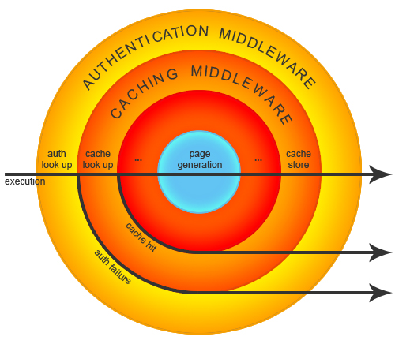

# Lifecycle

## Application Life Cycle

1. ### Instantiation

  	实例化Slim\App ,在实例化过程中，Slim为每个应用独立注册默认的服务

2. ###  Route Definitions

定义路由，get() post() patch() head() option() put() delete() 可以选择匿名函数或者指定类名

3. ### Application Runner

实例化APP 调用run() 

#### A. Enter Middleware Stack

Middlewares 在设置的时候，根据顺序已经构建了执行链路，app->run() 调用每一层的中间件执行逻辑，并以此唤醒下一层的中间件，直至到达最里面的核心，核心执行完业务逻辑，中间件以此返回一个response

#### B. Run Application

最里面一层裹着的是路由中间件，HTTP request 到达之后，调用路由解析器，查找对应的回调函数是否存在，不存在则抛出route is not found. Not Found 或者 Not Allowed handler 被唤醒

#### C. Exit Middleware Stack

所有的中间件的process执行完毕，response到达最外面一层

#### D. Send HTTP Response

调用php原生函数header,body等，输出buffer

## 参考架构图

